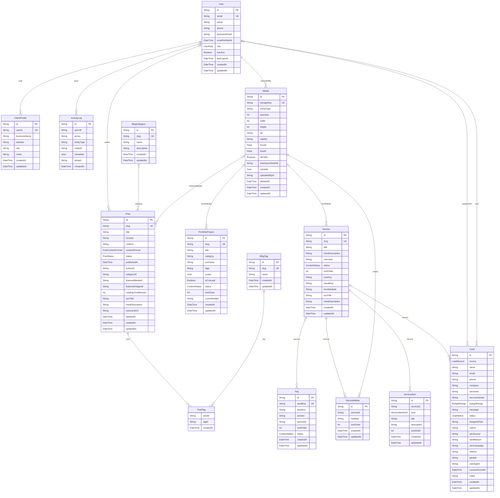

# AKZQ.Creation Entity Relationship Diagram (ERD)

Generated directly from `prisma/schema.prisma` AST.

```mermaid
erDiagram
  User {
    String id PK
    String email UK
    String name
    String phone
    String passwordHash
    DateTime emailVerifiedAt
    UserRole role
    Boolean isActive
    DateTime lastLoginAt
    DateTime createdAt
    DateTime updatedAt
  }
  ClientProfile {
    String id PK
    String userId UK
    String businessName
    String website
    String city
    String notes
    DateTime createdAt
    DateTime updatedAt
  }
  Lead {
    String id PK
    LeadSource source
    String name
    String email
    String phone
    String company
    String serviceId
    String serviceInterest
    BudgetRange budgetRange
    String message
    LeadStatus status
    String assignedToId
    String userId
    String utmSource
    String utmMedium
    String utmCampaign
    String referrer
    String ipHash
    String userAgent
    DateTime consentGivenAt
    String notes
    DateTime createdAt
    DateTime updatedAt
  }
  ActivityLog {
    String id PK
    String actorId
    String action
    String entityType
    String entityId
    Json metadata
    String ipHash
    DateTime createdAt
  }
  Media {
    String id PK
    String storageKey UK
    String mimeType
    Int byteSize
    Int width
    Int height
    String alt
    String caption
    Float focalX
    Float focalY
    Boolean isPublic
    String checksumSha256
    Json variants
    String uploadedById
    DateTime deletedAt
    DateTime createdAt
    DateTime updatedAt
  }
  Service {
    String id PK
    String slug UK
    String title
    String shortDescription
    String overview
    ContentStatus status
    Int sortOrder
    String iconKey
    String visualKey
    String heroMediaId
    String seoTitle
    String metaDescription
    DateTime createdAt
    DateTime updatedAt
  }
  ServiceItem {
    String id PK
    String serviceId
    ServiceItemKind kind
    String title
    String description
    Int sortOrder
    DateTime createdAt
    DateTime updatedAt
  }
  ServiceMedia {
    String id PK
    String serviceId
    String mediaId
    Int sortOrder
    DateTime createdAt
    DateTime updatedAt
  }
  Faq {
    String id PK
    String seedKey UK
    String question
    String answer
    String serviceId
    Int sortOrder
    ContentStatus status
    DateTime createdAt
    DateTime updatedAt
  }
  PortfolioProject {
    String id PK
    String slug UK
    String title
    String category
    String summary
    String tags
    Json scope
    Boolean isConcept
    ContentStatus status
    Int sortOrder
    String coverMediaId
    DateTime createdAt
    DateTime updatedAt
  }
  BlogCategory {
    String id PK
    String slug UK
    String name
    String description
    DateTime createdAt
    DateTime updatedAt
  }
  BlogTag {
    String id PK
    String slug UK
    String name
    DateTime createdAt
    DateTime updatedAt
  }
  Post {
    String id PK
    String slug UK
    String title
    String excerpt
    String content
    PostContentFormat contentFormat
    PostStatus status
    DateTime publishedAt
    String authorId
    String categoryId
    String featuredMediaId
    String featuredImageAlt
    Int readingTimeMinutes
    String seoTitle
    String metaDescription
    String canonicalUrl
    DateTime deletedAt
    DateTime createdAt
    DateTime updatedAt
  }
  PostTag {
    String postId
    String tagId
    DateTime createdAt
  }
  User ||--}o ClientProfile : "user"
  Service o|--}o Lead : "service"
  User o|--}o Lead : "assignedTo"
  User o|--}o Lead : "user"
  User o|--}o ActivityLog : "actor"
  User ||--}o Media : "uploadedBy"
  Media o|--}o Service : "heroMedia"
  Service ||--}o ServiceItem : "service"
  Service ||--}o ServiceMedia : "service"
  Media ||--}o ServiceMedia : "media"
  Service o|--}o Faq : "service"
  Media o|--}o PortfolioProject : "coverMedia"
  User o|--}o Post : "author"
  BlogCategory o|--}o Post : "category"
  Media o|--}o Post : "featuredMedia"
  Post ||--}o PostTag : "post"
  BlogTag ||--}o PostTag : "tag"
```
